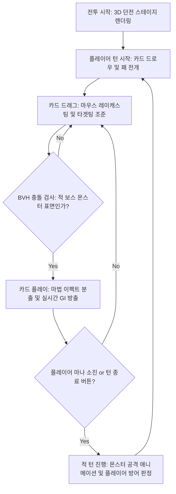

# 🃏 3D 로그라이크 덱빌딩 카드 게임 기획 및 설계서
**프로젝트명 (가제): Slay the WebGL (Chronicles of Light & Cards)**

본 문서는 교수님의 최종 과제 평가 기준(기획, 완성도, GI 기술 적용, 리포트 작성 편의성)을 극대화하여 통과하기 위해 작성된 3D 덱빌딩 카드 게임 개발 계획 및 세부 설계서입니다.

---

## 1. 프로젝트 개요

* **장르**: 3D 로그라이크 덱빌딩 카드 게임 (Slay the Spire 스타일)
* **플랫폼**: WebGL 기반 웹 브라우저 (HTML5 / Three.js)
* **개발 목표**: 
  * 3D 그래픽스 파이프라인의 핵심 연산(행렬 변환, 쿼터니언, 정점 셰이더 변형, BVH 충돌, GI)을 게임 시스템 내 핵심 매커니즘과 유기적으로 결합하여 완성도 높은 포트폴리오 수준의 웹 게임 빌드.
  * 리포트에 기술 적용 전/후 및 구현 과정을 실시간 캡쳐 이미지로 증명하기 쉽도록 시각 효과 극대화.

---

## 2. 핵심 게임 루프 및 콘텐츠 구성



* **전투 스테이지**: 3D 디오라마 스타일로 제작된 어두운 마법 유적 던전. 좌측에 3D 스켈레탈 기사(플레이어), 우측에 거대하고 정교한 3D 고렘(적 몬스터) 배치.
* **카드 시스템**: 패에 있는 3D 카드를 마우스로 집어 올려 드래그하여 적 위에 드롭하는 직관적인 타겟팅 배틀 방식.

---

## 3. 세부 기술 구현 스펙 (CG Technology Specifications)

### 3.1. 글로벌 일루미네이션 (GI) 구현 계획 (eval: 20점)
* **간접광 전파 기법**: **DDGI (Dynamic Diffuse GI)** 적용.
  * 던전 내부에 프로브 그리드(Probe Grid)를 배치하고, 각 프로브는 사방으로 레이를 캐스팅하여 조명 값을 캡처하고 **L1 Spherical Harmonics (SH)** 계수로 압축 및 캐싱합니다.
* **퍼즐/스킬 메커니즘 연계**: 
  * 플레이어가 카드를 낼 때 이펙트(화염, 냉기, 전기 등)가 **실시간 점광원(Point Light)**을 형성하여 주변 몬스터와 돌벽에 부딪힙니다.
  * 이때 벽면에 튕겨 나온 **간접광(GI)**이 전장의 어두운 구석구석을 은은하게 밝히며, 리포트에 라이팅 적용 전(Direct Light Only)과 적용 후(GI Enabled)의 비주얼 차이를 캡쳐하여 차별화된 가치를 증명합니다.

### 3.2. 꼭짓점 파동 및 정점 변형 (Vertex Shader Deformation)
* **마법 카드의 펄럭임**: 
  * 마우스로 3D 카드를 잡고 움직일 때 카드가 단순한 평면 판판한 상자가 아니라 마력에 의해 유연하게 휘어지는 시각 효과를 버텍스 셰이더(Vertex Shader)의 Sine/Cosine 기반의 물결 수식($y = A \cdot \sin(k \cdot x - w \cdot t)$)으로 구현합니다.
* **배경 마법 포탈**: 스테이지 배경에 일렁이는 마법 용암이나 불꽃 방벽의 파동 애니메이션을 정점 연산으로 구현합니다.

### 3.3. MeshBVH 기반 초고속 충돌 판정
* **동작 원리**: 
  * 마우스 포인터와 3D 카드가 적 몬스터 위에 올라갔는지 검사할 때, 몬스터 모델의 복잡한 기하학적 형태 때문에 전통적인 레이캐스팅은 큰 지연을 유발합니다.
  * 몬스터 메쉬에 `MeshBVH`를 빌드하여 바운딩 박스를 하향식 계층 구조로 신속히 제거함으로써 **매 프레임 마우스 포인터와 적 몬스터 간의 정확한 충돌 교차를 O(log N) 수준으로 판정**합니다.
* **시각화**: 디버그 모드에서 `MeshBVHHelper`를 켜두어 리포트에 계층적 바운딩 박스 트리 구조가 적용된 캡쳐 이미지를 첨부합니다.

### 3.4. 쿼터니언 (Quaternion) 및 행렬(Matrix) 수동 제어
* **부채꼴 패 정렬**: 드로우된 카드들이 플레이어 시점 아래쪽에 부채꼴 아크 모양으로 정렬되는 변환 연산을 $Translation \times Rotation$ 행렬 합성으로 직접 계산하여 배치합니다.
* **카드의 드래그 정렬**: 카드를 드래그할 때 카드가 짐벌 락(Gimbal Lock) 없이 마우스 포인터 방향으로 부드럽게 눕고 서는 회전 애니메이션을 쿼터니언 구면 선형 보간(**SLERP**)으로 처리합니다.
* **카메라 연출**: 플레이어 공격 시 적 방향으로 카메라가 부드럽게 지향하고 회전하는 뷰 행렬 제어를 적용합니다.

### 3.5. 비등방성 필터링 (Anisotropic Filtering) 및 재질 최적화
* **카드 텍스처 선명도**: 카드를 비스듬히 아래로 내려다보는 각도에서 텍스처가 흐려지는 것을 방지하기 위해 `anisotropy = 16` 필터링을 필수 적용합니다.
* **마법 보호막**: 방어막 카드를 쓸 때 캐릭터 주변에 생성되는 구체에 `MeshPhysicalMaterial`을 적용해 투명도와 굴절률(ior)을 갖춘 리얼한 마법 쉴드 재질을 연출합니다.

### 3.6. 캐릭터 리깅 및 스켈레탈 애니메이션
* 플레이어와 적 캐릭터에게 뼈(Bone)와 정점 가중치(Skin Weights)를 바인딩(Skinning)하여 공격, 대기, 피격 시의 스켈레탈 애니메이션을 구현합니다.

---

## 4. 디렉토리 구조 설계

```text
├── docs/
│   ├── requriments.md          # 교수님 요구사항
│   ├── game_proposals.md       # 기획안 후보군
│   └── slay_the_spire_design.md # 본 설계서
├── agent/
│   └── agent_reference_summary.md # 에이전트 참고용 기술 요약서
├── src/
│   ├── assets/                 # 카드 일러스트, 텍스처, 3D 모델 에셋
│   ├── css/
│   │   └── main.css            # 스타일링 (다크 테마, 고급 UI)
│   ├── js/
│   │   ├── main.js             # 게임 엔트리 포인트 및 루프 관리
│   │   ├── scene.js            # 3D 스테이지, 카메라, 라이팅 제어
│   │   ├── card.js             # 3D 카드 클래스 (행렬 정렬, SLERP 제어)
│   │   ├── character.js        # 캐릭터 스켈레탈 로딩 및 모션 제어
│   │   ├── collision.js        # MeshBVH 충돌 처리
│   │   └── gi_renderer.js      # DDGI/프로브 실시간 라이팅 제어
│   └── index.html              # 게임 구동 메인 웹페이지
├── node_modules/               # three.js, three-mesh-bvh 등 라이브러리
├── .gitignore                  # agent/ 폴더 및 node_modules/ 제외 설정
└── package.json
```

---

## 5. 단계별 개발 로드맵 (Development Roadmap)

1. **Phase 1: 개발 환경 구축 및 기본 3D 스테이지 렌더링**
   * Three.js 및 관련 라이브러리 설치, 디렉토리 구조화.
   * 카메라 뷰 행렬 및 기본 라이팅(Ambient, Directional) 설정.
2. **Phase 2: 3D 카드 드로우 & 아크 행렬 정렬 구현**
   * 3D 카드를 생성하고 드로우/패 정렬을 위한 $T \cdot R$ 변환 행렬 수동 제어 구현.
   * 카드를 드래그할 때 마우스 축에 맞추어 카드가 눕고 서는 회전을 쿼터니언 SLERP로 보간.
3. **Phase 3: 몬스터 스켈레탈 로드 및 MeshBVH 충돌 연동**
   * 3D 몬스터 로딩 및 기본 스켈레탈 애니메이션 루프 적용.
   * 몬스터 메쉬에 대한 `MeshBVH`를 구축하고, 카드 드래그 레이캐스팅이 몬스터에 충돌하는지를 정밀 연산 및 판정.
4. **Phase 4: 마법 셰이더(Vertex Deformation) 및 실시간 GI 구현**
   * 카드가 휘는 펄럭임 효과 정점 셰이더 적용.
   * 마법 구체 발사 시 씬 전체의 프로브를 업데이트하고 간접광을 전파하는 실시간 DDGI(프로브 SH) 라이팅 연동.
5. **Phase 5: UI/UX 고도화, 디버깅 및 배포 최적화**
   * PBR 물리 재질 조절, 그림자 맵 튜닝을 통한 완성도 극대화.
   * 웹 배포 링크 생성 및 리포트 작성 준비 완료.
