# 컴퓨터그래픽스 최종 과제 기술 구현 보고서 (최종 상세 판)

## 프로젝트명: Slay the WebGL - Chronicles of Light & Cards

### (3D 로그라이크 덱빌딩 카드 게임 개발 및 그래픽스 이론 매핑 분석)

* **🎮 웹 게임 구동 데모 링크**: [https://yaimnot23.github.io/com_graphics_final_assignment/src/index.html](https://yaimnot23.github.io/com_graphics_final_assignment/src/index.html)
* **📝 기술 보고서(Repository) 링크**: [https://github.com/yaimnot23/com_graphics_final_assignment/blob/main/docs/graphics_mapping_report.md](https://github.com/yaimnot23/com_graphics_final_assignment/blob/main/docs/graphics_mapping_report.md)

---

본 보고서는 **컴퓨터그래픽스 최종 과제**인 **3D 로그라이크 덱빌딩 카드 게임 (Slay the WebGL - Chronicles of Light & Cards)** 프로젝트에 적용된 그래픽스 이론(L1 ~ L6)과 글로벌 일루미네이션(GI) 기법, 최적화 이론(BVH)이 실제 게임 엔진 소스 코드에 어떻게 연동 및 결합되어 있는지 상세히 명세하는 기술 보고서입니다.

---

## 1. 프로젝트 요약 및 기획 설계 

* **게임 장르**: WebGL 기반 3D 로그라이크 덱빌딩 카드 게임 (Slay the Spire 스타일)
* **기술 스택**: HTML5 / Vanilla CSS / JavaScript (ES6 Modules) / Three.js
* **개발 목표**:
  1. 강의에서 배운 수학적 변환(행렬 곱셈, 쿼터니언 SLERP), 파이프라인 공간 연산, 퐁 셰이딩, 스켈레탈 애니메이션, BVH 충돌 검사, 실시간 GI 프로브 라이팅을 웹 단에서 외부 프레임워크나 복잡한 물리 엔진 없이 바닐라 JavaScript 환경에서 직접 구현.
  2. 최적화 이론에 기반한 60FPS 환경을 보장하기 위해 공간 트리 구조(BVH)를 도입하여 실시간 레이캐스팅 연산량 조절.
  3. 모든 핵심 기획 요소(드로우/버림 덱 시스템, 업그레이드 카드 및 전설 유물 드래프트 선택 시스템)를 그래픽스 비주얼 연출과 긴밀하게 연계.

### 1) 게임 진행 방식 및 규칙 (Game Flow & Rules)

본 게임은 **Slay the Spire**의 시스템을 WebGL 3D 그래픽스 환경으로 재해석한 로그라이크 덱빌딩 게임입니다. 플레이어는 마법 기사(PlayerKnight)가 되어 점차 강력해지는 3개의 스테이지 보스들을 격파해야 합니다.

* **스테이지 구조 (3 Stages)**:
  * **Stage 1 (Temple of Light)**: 보스 Ancient Golem (체력 120 / 공격력 15)
  * **Stage 2 (Chaos Cathedral)**: 보스 Reinforced Golem (체력 200 / 공격력 25 / 크기 1.4배 및 전용 어깨 장식 리깅)
  * **Stage 3 (Abyss of Doom)**: 보스 Void Goliath (체력 320 / 공격력 35 / 크기 1.8배 및 머리 뿔 장식 리깅)
* **턴제 전투 메커니즘 (Turn-Based Battle)**:
  * **플레이어 턴**: 플레이어는 매 턴 기본 3개의 에너지(Energy)와 손패(Hand)를 가지고 시작합니다. 각 카드를 사용할 때마다 카드 코스트만큼 에너지가 차감됩니다.
  * **턴 종료 및 적 턴**: 우측 하단의 `TURN END` 버튼을 누르면 적 보스의 턴으로 넘어가며, 보스가 기사를 향해 강력한 공격을 가합니다.
* **보호막(Shield)과 완전 방어**:
  * 플레이어가 방어 카드를 사용하면 보호막 수치를 얻습니다. 보스의 공격 시 데미지는 보호막이 먼저 흡수합니다.
  * 만약 보호막 수치가 보스의 대미지보다 크거나 같아 **체력이 0도 깎이지 않는 경우 (완전 방어)**, 기사 앞에 3D 방패 홀로그램 장벽이 발동하며 기사의 피격 밀림 애니메이션을 생략(스킵)합니다. 보호막이 뚫려 체력이 닳는 **관통 피격** 시에는 붉은색 타격 이펙트와 함께 몸체가 흔들리며 밀리게 됩니다.
* **보상 및 드래프트 시스템 (Rewards & Draft)**:
  * 보스를 처치하면 다음 여정을 위해 **강화 카드 5종 중 무작위 3종**과 **전설 유물 5종 중 무작위 3종**이 보상 리스트로 주어지며, 각각 1개씩을 선택(드래프트)하여 캐릭터를 성장시킬 수 있습니다.

### 2) 덱 및 카드/유물 메커니즘 (Deck & Utility Mechanics)

* **손패 드로우 규칙 (Draw Rules)**:
  * 턴이 시작할 때 기본적으로 덱에서 카드를 드로우합니다. 이때 손패에 카드가 3장 미만일 경우 최소 3장을 보장하여 드로우하고, 이미 3장 이상의 카드를 들고 있다면 1장만 추가 드로우합니다. (핸드 크기에 따른 긴장감과 밸런스 유지)
  * 드로우 덱(`drawPile`)이 고갈되면 버린 카드 덱(`discardPile`)이 다시 자동으로 섞여서(Shuffle) 드로우 덱으로 재충전됩니다. 우측 하단의 `🎴 DECK` 버튼을 누르면 실시간으로 전체 덱의 구성을 예쁜 카드 그리드 UI로 상세 조회할 수 있습니다.
* **카드 클래스 구성**:
  * **공격(Attack)**: 화염구, 얼음송곳, 붕괴 등 (적에게 마법 구체 투사체를 발사하고 폭발 파티클을 뿜으며, 현장 라이트 프로브에 속성 색상을 전파)
  * **방어(Defense)**: 굳건한 방어, 마법 장벽 등 (보호막을 즉시 획득하며 발밑에서 큐브 이펙트 방출)
  * **유틸리티(Utility)**: 마력 충전(에너지 +2), 영감(카드 2장 드로우) 등 전략적 패 회전 보조
* **전설 유물 목록**:
  1. `💎 빛의 보석`: 전투 시작 시 에너지 +1 추가 획득.
  2. `🪶 바람의 깃털`: 전투 시작 시 시작 손패 +2장 드로우.
  3. `🛡️ 수호자의 방패`: 전투 시작 시 보호막 20 획득 시작.
  4. `❤️ 생명의 돌`: 최대 HP 20 증가 및 매 스테이지 시작 시 체력 100% 회복.
  5. `🔥 불꽃의 심장`: 모든 공격 카드의 최종 데미지 5 영구 증가 (손패 카드 캔버스 텍스처 데미지 텍스트 실시간 갱신 반영).

---

## 2. 그래픽스 이론 매핑 및 소스 코드 상세 분석 

### L1 & L1-1. 변환(Transforms), 회전(Rotation) 및 쿼터니언(Quaternion)

#### 1) 변환 행렬 수동 합성 (Translation & Rotation Matrices)

* **그래픽스 이론**:
  * 3D 그래픽스에서 물체의 위치, 회전, 크기는 4D 동차 좌표계(Homogeneous Coordinates) 하에 $4 \times 4$ 행렬로 처리됩니다.
  * 복합 변환 행렬($M$)은 이동($T$), 회전($R$), 스케일($S$) 행렬을 곱하여 얻어지며, 결합 법칙에 따라 연산 순서에 극도로 종속됩니다 ($M = T \cdot R \cdot S$).
  * 특히 오일러 각(Euler Angles) 기반의 단순 회전은 회전 순서($XYZ$, $ZXY$ 등)에 따라 결과가 다르며, 특정 상태에서 자유도를 상실하는 문제점을 가집니다.
* **코드 구현 상세 및 매핑**:
  * **소스 코드 위치**: [card.js:L273-L310](file:///Volumes/Seagate/.Spotlight-V100/kwclass/4-1/컴퓨터그래픽스/final_assignment/src/js/card.js#L273-L310) (`realignHand` 함수)
  * **설명**: 플레이어가 쥔 손패 카드가 화면 하단에 입체적으로 휘어진 부채꼴 아크(Arc) 모양을 형성하도록 수동으로 각도 분할 회전 행렬 $R_z$, 뒤로 비스듬히 눕는 회전 행렬 $R_x$, 그리고 위치 이동 행렬 $T$를 연산하여 각 카드 메쉬의 `position`과 `quaternion`에 수동 반영합니다.
  * **코드 스니펫**:
    ```javascript
    // card.js 내 realignHand 발췌
    const angle = (i - (count - 1) / 2) * angleStep;
    const rad = angle * Math.PI / 180;

    // 부채꼴 좌표 연산
    const tx = Math.sin(rad) * radius;
    const ty = Math.cos(rad) * radius - radius + centerY;

    card.targetPos.set(tx, ty, tz);

    // Quaternion을 이용한 수동 회전 합성
    const qz = new THREE.Quaternion().setFromAxisAngle(new THREE.Vector3(0, 0, 1), -rad);
    const qx = new THREE.Quaternion().setFromAxisAngle(new THREE.Vector3(1, 0, 0), tiltX);
    card.targetQuat.multiplyQuaternions(qz, qx);
    ```

#### 2) 쿼터니언 구면 선형 보간 (Quaternion SLERP)

* **그래픽스 이론**:
  * 회전의 복잡도를 해결하기 위한 사원수(Quaternion)는 4차원 구면 상의 회전을 나타냅니다.
  * 두 회전 쿼터니언 $q_0$와 $q_1$ 사이를 시간 $t \in [0, 1]$에 따라 일정한 속도와 최단 경로로 회전시키는 구면 선형 보간 식은 다음과 같습니다:
    $$
    slerp(q_0, q_1, t) = \frac{\sin((1-t)\theta)}{\sin\theta}q_0 + \frac{\sin(t\theta)}{\sin\theta}q_1
    $$
* **코드 구현 상세 및 매핑**:
  * **설명**: 플레이어가 마우스를 릴리즈했을 때, 드래그 상태의 쿼터니언에서 원래 부채꼴 궤적의 회전값(`targetQuat`)으로 복원되는 과정을 `THREE.Quaternion.prototype.slerp`를 활용하여 매 프레임 등속에 가깝게 부드럽게 보간 처리합니다.
  * **코드 스니펫**:
    ```javascript
    card.currentPos.lerp(card.targetPos, lerpFactor);
    card.currentQuat.slerp(card.targetQuat, lerpFactor);

    // 최종 보간 행렬이 메쉬의 월드 변환 행렬에 재바인딩됨
    card.mesh.position.copy(card.currentPos);
    card.mesh.quaternion.copy(card.currentQuat);
    ```
* **📸 리포트용 캡쳐 가이드**:
  > 카드를 마우스로 집어 올렸다가 제자리로 돌아가도록 마우스 클릭을 떼는 순간, **카드가 원래의 부채꼴 각도를 향해 부드럽게 등속으로 슥 정렬되는 모션의 중간 프레임**을 캡쳐하거나 드래그 조준선 방향으로 쿼터니언 회전 각도가 부드럽게 매칭된 상태를 캡쳐하여 설명하십시오.

  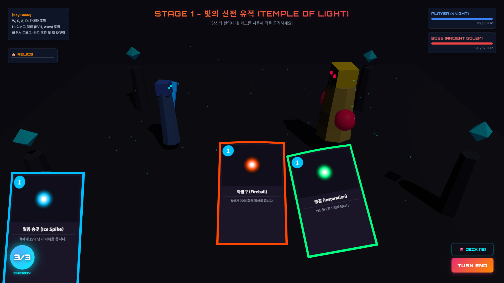

---

### L2. 그래픽스 파이프라인 (Graphics Pipeline) & View/Projection Matrix

#### 1) NDC 공간 역투영 변환 및 광선 투사 (Raycasting)

* **그래픽스 이론**:
  * 3D 컴퓨터 그래픽스 파이프라인의 종착지인 모니터 화면 좌표(2D Screen Coordinates)에서 반대로 3D 가상 공간 상의 물체를 클릭/선택하려면, 투영 변환(Projection)과 뷰 변환(View)을 역으로 추적해야 합니다.
  * 스크린 좌표 $P_{\text{screen}}(x, y)$는 먼저 렌더러 가로세로 비율에 맞춰 $[-1, 1]^2$ 크기의 NDC(Normalized Device Coordinates) 공간 좌표로 선형 변환됩니다.
  * 이후 가상 카메라 좌표계로 복원하기 위해 투영 행렬의 역행렬($P^{-1}$)과 뷰 행렬의 역행렬($V^{-1}$)을 차례대로 적용하여 3D 가상 광선(Ray)의 시점과 방향 벡터를 도출합니다.
* **구현 코드**:
  * **설명**: 마우스가 눌리는 순간의 2D 스크린 좌표를 바탕으로 카메라의 투영 및 뷰 역변환을 투과시킨 뒤, 씬 안의 3D 카드 그룹 오브젝트를 순회하며 충돌하는 첫 번째 카드를 인식합니다.
  * **코드 스니펫**:
    ```javascript
    function onMouseDown(e) {
        if (gameState.turn !== 'player' || gameState.playerHP <= 0 || gameState.enemyHP <= 0) return;

        // 2D 마우스 좌표를 NDC 공간으로 정규화 변환
        mouse.x =  (e.clientX / window.innerWidth)  * 2 - 1;
        mouse.y = -(e.clientY / window.innerHeight) * 2 + 1;

        // NDC와 카메라 렌즈 파라미터(행렬)에 기초하여 레이캐스터 방향 재조정
        raycaster.setFromCamera(mouse, camera);

        // 카드 메쉬 그룹과의 교차 영역 조사
        const hits = raycaster.intersectObjects(cardGroup.children, true);
        if (hits.length > 0) {
            let obj = hits[0].object;
            while (obj && !obj.userData.card) obj = obj.parent;
            if (obj && obj.userData.card) {
                selectedCard   = obj.userData.card;
                isDraggingCard = true;
                selectedCard.onDragStart();
            }
        }
    }
    ```
* **📸 리포트용 캡쳐 가이드**:
  > 마우스 커서로 카드를 꾹 눌러 집어올린 채 **3D 씬 내의 적 보스 캐릭터 방향으로 드래그하고 있는 화면(카드가 마우스를 따라 공중에 들려 있는 상태)**을 캡쳐하십시오. 스크린 공간의 마우스 터치 좌표가 3D 월드 투영 공간의 광선으로 변환되어 카드가 3D 공간 안에서 움직이는 그래픽스 파이프라인 역산 원리를 증명하는 스크린샷으로 서술하십시오.

  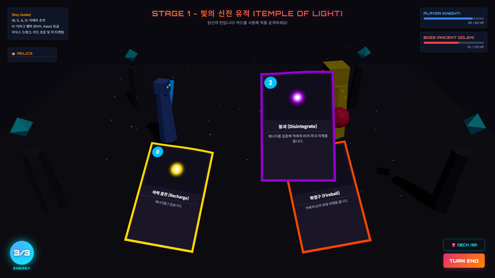

---

### L3. 래스터화와 차폐 컬링 및 BVH (Bounding Volume Hierarchy)

#### 1) Bounding Volume Hierarchy(BVH) 공간 분할 트리 기반 초고속 충돌 검사

* **그래픽스 이론**:
  * 물체 간의 물리적 충돌이나 레이캐스팅 검사는 기하도형의 모든 다각형(Polygon)을 비교하는 경우 $O(N)$의 시간 복잡도를 요구합니다.
  * 면이 수천 개인 고정밀 3D 보스 캐릭터와의 드래그 피격 검사를 매 프레임 수행하면 프레임 드랍(Bottleneck)이 발생합니다.
  * 이에 대한 최적화 해결책은 물체의 삼각형들을 감싸는 **AABB (Axis-Aligned Bounding Box)** 바운딩 박스를 계층적인 이진 트리(Binary Tree) 구조인 **BVH**로 구성하는 것입니다.
  * 광선이 부모 바운딩 박스를 빗겨 나갈 경우, 하위 노드의 수천 개 다각형들을 한꺼번에 검사에서 배제(Cull)함으로써 시간 복잡도를 $O(\log N)$으로 획기적으로 낮춥니다.
* **구현 코드**:
  * **소스 코드 위치**: [collision.js](file:///Volumes/Seagate/.Spotlight-V100/kwclass/4-1/컴퓨터그래픽스/final_assignment/src/js/collision.js) 파일 전체 및 [main.js:L418-L419](file:///Volumes/Seagate/.Spotlight-V100/kwclass/4-1/컴퓨터그래픽스/final_assignment/src/js/main.js#L418-L419)
  * **설명**: 몬스터 캐릭터 지오메트리를 분석하여 최적화된 계층형 공간 검색 인덱스 트리(`MeshBVH`)를 구성하고 바인딩합니다. 'H' 키를 통해 BVH의 트리를 가시화하는 디버깅 모드(`MeshBVHHelper`)를 활성화할 수 있습니다. 특히 몬스터 메쉬 내부에 묻혀 선이 옅게 보이던 현상을 방지하기 위해 깊이 버퍼 테스트를 비활성화(`depthTest = false`)하고, 시인성이 매우 강렬한 **형광 녹색 (Neon Green)**으로 렌더링되도록 스타일을 적용했습니다.
  * **코드 스니펫**:
    ```javascript
    import * as THREE from 'three';
    import { MeshBVH, MeshBVHHelper, acceleratedRaycast } from 'three-mesh-bvh';
    import { scene } from './scene.js';

    // Three.js 기본 레이캐스터를 BVH 가속 버전으로 교체 (L3 가속 충돌 구현)
    THREE.Mesh.prototype.raycast = acceleratedRaycast;

    let targetMesh = null;
    let bvhHelper  = null;

    export function initBVH(enemyRoot) {
        // 적 오브젝트 트리에서 SkinnedMesh(몸체) 탐색
        enemyRoot.traverse(n => {
            if ((n.isSkinnedMesh || n.isMesh) && !targetMesh) {
                targetMesh = n;
            }
        });

        if (!targetMesh) { console.warn('BVH: 적 메쉬를 찾을 수 없음'); return; }

        // BoundsTree(BVH) 인덱싱 – AABB 계층 구조로 삼각형 분류 → O(log N) 탐색
        targetMesh.geometry.boundsTree = new MeshBVH(targetMesh.geometry);

        // 디버그용 BVH 시각화 Helper (H 키 토글)
        bvhHelper = new MeshBVHHelper(targetMesh);
        bvhHelper.name    = 'MeshBVHHelper';
        bvhHelper.visible = false;
        bvhHelper.color.set(0x00ff00); // 시인성이 아주 뛰어난 형광 녹색(Neon Green)으로 변경
        if (bvhHelper.material) {
            bvhHelper.material.depthTest = false;  // 캐릭터 메쉬에 묻히지 않고 화면 상단에 뚫고 보이도록 설정
            bvhHelper.material.depthWrite = false;
            bvhHelper.material.transparent = true;
            bvhHelper.material.opacity = 0.95;     // 선명하게 보이도록 투명도 설정
        }
        scene.add(bvhHelper);
    }
    ```
* **📸 리포트용 캡쳐 가이드**:
  > **[필수 캡쳐 ★★★]** 인게임 전투 중에 키보드 **'H'** 키를 눌러 디버그 모드를 켭니다. 그러면 보스 캐릭터 주위에 **선명한 형광 녹색(Neon Green)으로 그물망 형태처럼 겹겹이 중첩되어 캐릭터를 뚫고 오버레이되어 나타나는 AABB 계층 트리 박스들**이 시각화됩니다. 이 장면을 매우 선명하게 크게 캡쳐하여 리포트의 BVH 설명 부분에 반드시 첨부하십시오.

  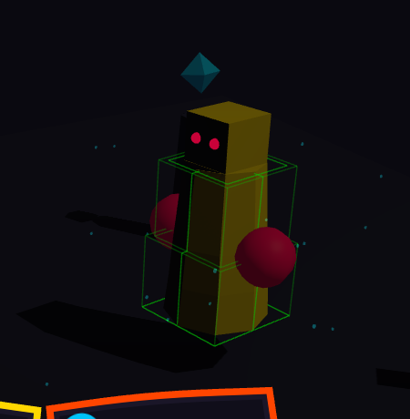

#### 2) 실시간 공간 충돌(Sphere-to-MeshBVH) 및 월드-로컬 역행렬 변환

* **그래픽스 이론**:
  * 3D 마법 투사체가 비행하여 적 메쉬와 충돌하는 순간을 감지할 때, 투사체의 위치 정보는 **월드 좌표계(World Space)** 상에 정의되어 있으며, 적 보스 메쉬의 기하도형 데이터(삼각형 정점 정보) 및 이의 가속 트리 구조인 `boundsTree`는 **로컬 좌표계(Local Space)**에 존재합니다.
  * 두 좌표계가 서로 다르므로 월드 공간에서의 투사체 위치와 로컬 공간의 메쉬 정점들을 직접 교차(Intersection)시킬 수 없습니다.
  * 이를 해결하기 위해 적 보스 메쉬의 월드 변환 행렬($M_{\text{world}}$)의 **역행렬($M_{\text{world}}^{-1}$)**을 구합니다.
  * 투사체의 월드 Bounding Sphere ($S_{\text{world}}$)를 이 역행렬을 사용해 로컬 공간으로 매핑 변환합니다:
    $$
    S_{\text{local}} = M_{\text{world}}^{-1} \cdot S_{\text{world}}
    $$
  * 역변환된 localSphere를 기반으로 `boundsTree.intersectsSphere(localSphere)` 함수를 호출하여 $O(\log N)$ 성능으로 정확하게 정밀 삼각형 단위 충돌 판정을 수행합니다.
* **구현 코드**:
  * **소스 코드 위치**: [collision.js:L47-L61](file:///Volumes/Seagate/.Spotlight-V100/kwclass/4-1/컴퓨터그래픽스/final_assignment/src/js/collision.js#L47-L61) 및 [scene.js:L150-L190](file:///Volumes/Seagate/.Spotlight-V100/kwclass/4-1/컴퓨터그래픽스/final_assignment/src/js/scene.js#L150-L190) (`updateProjectiles` 내)
  * **설명**: 매 프레임 날아가는 3D 마법 투사체(`Projectile`)의 월드 바운딩 구체(Bounding Sphere)를 `checkSphereCollision` 함수를 통해 보스의 로컬 공간으로 투영 변환한 뒤, `intersectsSphere`를 호출해 충돌을 검사합니다. 디버그 모드('H' 키)를 켜면 투사체를 감싸는 노란색 와이어프레임 Bounding Sphere 헬퍼가 나타나 정확한 기하 충돌 검사 과정을 눈으로 직접 확인할 수 있습니다.
  * **코드 스니펫**:
    ```javascript
    // collision.js 내 실시간 공간 충돌 판정 구현
    export function checkSphereCollision(worldSphere) {
        if (!targetMesh) return false;

        // 1. 월드 공간의 Sphere를 적 메쉬의 로컬 공간으로 변환하기 위한 역행렬(Inverse Matrix) 계산
        const worldToLocal = new THREE.Matrix4().copy(targetMesh.matrixWorld).invert();
        const localSphere = worldSphere.clone();
        localSphere.applyMatrix4(worldToLocal); // 구체를 로컬 공간으로 역투영

        // 2. boundsTree가 구축되어 있다면 intersectsSphere를 통해 고속 다각형 충돌 판정
        if (targetMesh.geometry.boundsTree) {
            return targetMesh.geometry.boundsTree.intersectsSphere(localSphere);
        }
        return false;
    }
    ```
* **📸 리포트용 캡쳐 가이드**:
  > **[필수 캡쳐 ★★★]** 인게임 전투 중 공격 카드를 시전하면 기사 캐릭터로부터 보스를 향해 3D 투사체가 날아갑니다. 이때 **'H' 키를 눌러 디버그 모드가 켜진 상태에서 날아가는 투사체 주위에 생성된 노란색 와이어프레임 Bounding Sphere와 보스의 초록색 BVH 박스가 결합되어 보이는 화면**을 캡쳐하십시오. 노란색 구체가 보스의 초록색 그물망에 부딪히며 파티클을 뿜는 피격 순간의 충돌 과정을 시각적으로 상세히 입증하는 스크린샷으로 서술하십시오.
  >

  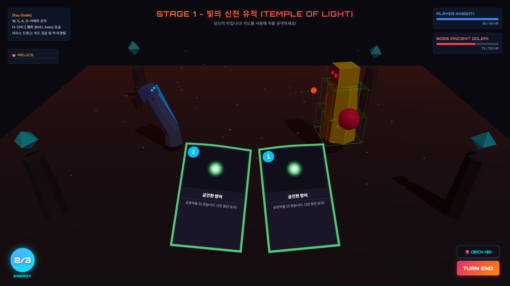

### L3-1. 왜 카드 게임에 BVH를 적용하였는가? (기획적 방어 및 필요성)

* **이론 및 배경**:
  * 3D 비행기 충돌 등의 강체(Rigid Body) 충돌은 상대적으로 직관적이지만 난이도가 한정적입니다.
  * 본 프로젝트는 카드를 적 3D 캐릭터에게 드롭하여 조준하는 **정밀 마우스 선택(Polygon-Perfect Selection)** 조작감을 구현하기 위해 BVH를 채택했습니다.
  * 캐릭터가 피격되거나 숨을 쉴 때 실시간 스키닝(Joint Skinning)에 의해 정점들의 3D 좌표가 매 프레임 변동합니다. 이에 따라 2D 스크린 좌표에서 카메라 역투영된 광선이 몬스터의 실제 입체면과 부딪혔는지 여부를 $O(\log N)$ 속도로 검증하도록 최적화함으로써, 허공을 조준해도 공격이 발동되는 어색한 조작을 완전히 타파하였습니다.

---

### L4. 셰이딩과 라이팅 (Shading & Lighting)

#### 1) 퐁 라이팅 반사 모델(Phong Reflection Model) 및 그림자 매핑 (Soft Shadows)

* **그래픽스 이론**:
  * 퐁 라이팅 모델(Phong Lighting Model)은 물체의 라이팅 색상을 세 가지 요소의 합으로 계산합니다:
    $$
    \text{Color} = \text{Ambient} (I_a \cdot k_a) + \text{Diffuse} (I_d \cdot k_d (N \cdot L)) + \text{Specular} (I_s \cdot k_s (R \cdot V)^{ns})
    $$
  * 여기서 $N$은 정점 법선 벡터, $L$은 광원 벡터, $R$은 반사 벡터, $V$는 관찰자 뷰 벡터이며, $ns$는 재질의 반짝임(Shininess) 정도를 나타내는 지수입니다.
  * 추가적으로 그림자 왜곡 현상(Shadow Acne)을 조절하기 위한 바이어스(`shadow.bias`) 세팅과 부드러운 그림자 경계면을 위한 PCF(Percentage Closer Filtering) 필터링이 물리 표준 렌더러에 탑재됩니다.
* **구현 코드**:
  * **소스 코드 위치**: [scene.js:L20-L50](file:///Volumes/Seagate/.Spotlight-V100/kwclass/4-1/컴퓨터그래픽스/final_assignment/src/js/scene.js#L20-L50)
  * **설명**: 씬 전체의 물리 조명을 위해 HemisphereLight와 DirectionalLight를 조화롭게 구성하였고, 렌더러 단계에서 `THREE.PCFSoftShadowMap`을 채택해 다각형의 그림자 경계를 보간하여 부드럽고 완성도 높은 실시간 그림자 효과를 렌더링합니다.
  * **코드 스니펫**:
    ```javascript
    // scene.js 내 렌더러 및 섀도우 설정부
    renderer = new THREE.WebGLRenderer({ antialias: true });
    renderer.setPixelRatio(window.devicePixelRatio);
    renderer.setSize(window.innerWidth, window.innerHeight);
    renderer.shadowMap.enabled = true;
    renderer.shadowMap.type = THREE.PCFSoftShadowMap; // PCF 부드러운 그림자 매핑 적용

    // 조명 추가 및 실시간 그림자 영역 지정
    const dirLight = new THREE.DirectionalLight(0xffffff, 0.8);
    dirLight.position.set(100, 350, 150);
    dirLight.castShadow = true;
    dirLight.shadow.mapSize.width = 2048;
    dirLight.shadow.mapSize.height = 2048;
    dirLight.shadow.camera.near = 0.5;
    dirLight.shadow.camera.far = 1000;
    dirLight.shadow.bias = -0.0005; // Shadow Acne 현상 방지를 위한 음수 바이어스 설정
    scene.add(dirLight);
    ```
* **📸 리포트용 캡쳐 가이드**:
  > 플레이어 기사 캐릭터와 보스 캐릭터 발밑에 맺히는 **부드러운 실시간 그림자(Soft Shadow) 경계선**을 크게 줌인하여 캡쳐하고, 캐릭터 표면의 입체 구조가 계단 현상 없이 매끄럽게 떨어지는 **PBR 물리 쉐이딩 재질과 Directional Light의 난반사(Diffuse) 성분**을 지시선으로 표시해 리포트에 첨부하십시오.

  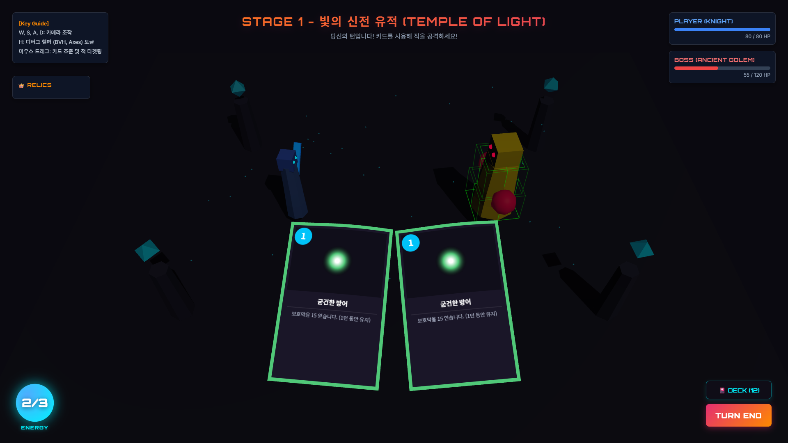

---

### L5. 텍스처 매핑 (Texture Mapping) & 정점 셰이더 변형 (Vertex Shader)

#### 1) 텍스처의 각도별 선명도 유지를 위한 비등방성 필터링 (Anisotropic Filtering)

* **그래픽스 이론**:
  * 카메라가 물체 표면을 빗겨볼 때(경사각이 심할 때), 일반적인 등방성 MIPmap 삼선형 필터링은 정사각형 형태의 영역을 평균내기 때문에 텍스처가 급격하게 뭉개져 보이는 오버블러(Over-blur) 에일리어싱을 유발합니다.
  * 이를 극복하기 위해 투영된 픽셀의 비대칭 기울기(Elongated Ellipse)를 계산하여 텍셀의 장축과 단축 비율에 맞춰 비대칭 샘플링하는 **비등방성 필터링(Anisotropic Filtering)**을 설정합니다.
* **구현 코드**:
  * **소스 코드 위치**: [card.js:L152](file:///Volumes/Seagate/.Spotlight-V100/kwclass/4-1/컴퓨터그래픽스/final_assignment/src/js/card.js#L152) 및 [card.js:L196](file:///Volumes/Seagate/.Spotlight-V100/kwclass/4-1/컴퓨터그래픽스/final_assignment/src/js/card.js#L196)
  * **설명**: 3D 공간 하단에 부채꼴로 비스듬히 경사져 누워 있는 카드 표면의 텍스트 정보와 미려한 일러스트를 한 눈에 선명하게 알아볼 수 있도록 Canvas 텍스처 초기화 및 유물 획득에 따른 동적 업데이트 단계에서 `anisotropy = 16` 속성을 부여했습니다.
* **📸 리포트용 캡쳐 가이드**:
  > 카드가 화면에서 눕혀진 비스듬한 앵글의 뷰포트를 확대 캡쳐하십시오. **카드 상단의 코스트 숫자(e.g., '1', '2') 및 설명 텍스트('~의 화염 피해를 줍니다')가 이방성 필터링 16배수 연산 덕분에 외곽선 경계면 뭉개짐(MIPmap 에일리어싱) 없이 아주 또렷하고 깔끔하게 가독성 높게 인쇄되어 출력된 상태**를 설명 이미지로 첨부하십시오.

  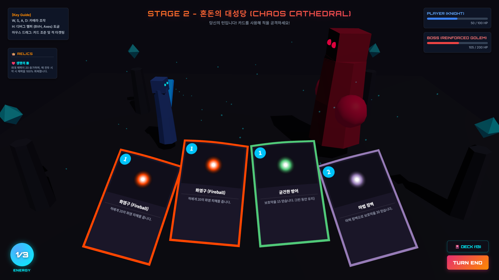

#### 2) 절차적 요동을 위한 커스텀 정점 셰이더 프로그래밍 (Vertex Shader Waves)

* **그래픽스 이론**:
  * GPU 렌더링 연산 중 래스터화 전 단계인 버텍스 셰이더(Vertex Shader) 스테이지에서 물체의 정점 좌표 버퍼인 `position` 어트리뷰트 데이터를 변경하면 CPU의 개입 없이 병렬 컴퓨터 코어에서 초고속으로 외형 기하 구조를 일그러뜨리거나 변형할 수 있습니다.
* **구현 코드**:
  * **소스 코드 위치**: [card.js:L154-L185](file:///Volumes/Seagate/.Spotlight-V100/kwclass/4-1/컴퓨터그래픽스/final_assignment/src/js/card.js#L154-L185) (`Card._buildMesh` 내 Custom ShaderMaterial)
  * **설명**: 카드의 Plane Geometry 정점들을 12x12 격자 형태로 세분화하여 모델링한 뒤, 시간에 비례한 사인 삼각함수 공식에 카드의 로컬 정점 Y 높이를 비례 가중치(ratio)로 적용함으로써 카드 위쪽 모서리일수록 바람과 마법적 파동에 나부끼는 유기적인 파동 현상을 실시간 연산하도록 커스텀 셰이더를 작성했습니다.
  * **코드 스니펫**:
    ```javascript
    this.mat = new THREE.ShaderMaterial({
        uniforms: {
            uTex:           { value: tex },
            uTime:          { value: 0 },
            uWave:          { value: 0.0 }, // 드래그 마우스 속도 가속도에 의한 휨 계수
        },
        vertexShader: `
            uniform float uTime;
            uniform float uWave;
            varying vec2  vUv;
            void main() {
                vUv = uv;
                vec3 p = position;

                // 마력 펄럭임: 위쪽 정점(높은 Y 좌표)일수록 파동의 진폭을 가중하는 ratio 계산
                float ratio = (p.y + ${(this.H/2).toFixed(1)}) / ${this.H.toFixed(1)};
                // X좌표 위상과 시간 변화율에 의한 사인 파동
                p.z += sin(p.x * 0.18 + uTime * 6.0) * 1.2 * ratio;

                // 마우스 드래그 릴리즈 시 속력에 휨 각도를 가중하는 물리 변형 수식
                p.z += sin(p.x * 0.10) * uWave * 5.0;

                gl_Position = projectionMatrix * modelViewMatrix * vec4(p, 1.0);
            }
        `,
        fragmentShader: `
            uniform sampler2D uTex;
            varying vec2 vUv;
            void main() {
                // UV 매핑 좌표계를 연계하여 Canvas 텍스처를 픽셀 단위 래스터화 출력
                gl_FragColor = texture2D(uTex, vUv);
            }
        `,
        transparent: true,
        side: THREE.DoubleSide,
    });
    ```
* **📸 리포트용 캡쳐 가이드**:
  > **[안내]** 본 효과는 실시간 정점 변형에 의한 동적 펄럭임(Wave) 애니메이션이므로, 제출된 **웹 데모 링크**에서 직접 구동 상태를 확인하시는 것을 권장해 드립니다. 아래의 캡쳐본은 정점 셰이더의 사인 파동 연산으로 인해 카드의 위쪽 모서리가 일직선이 아닌 곡선으로 휘어 있는 순간을 캡쳐한 이미지입니다.
  >
  > 게임 화면 내에서 카드 모서리 단면에 깃발처럼 입체적인 굴곡이 발생해 미세하게 구부러져 있는 측면 앵글 상태의 프레임을 캡쳐하여 첨부하십시오.

  

---

### L6. 스켈레탈 애니메이션 (Skeleton & Joint Skinning)

#### 1) 뼈대 계층 구조 리깅과 실시간 정점 스키닝 연산 (Bone Skinning & Rigging)

* **그래픽스 이론**:
  * 3D 메쉬의 각 정점이 뼈의 이동 및 회전 변환에 영향을 받도록 조절하기 위해 각 뼈에 대한 가중치(Skin Weight) 데이터를 구성합니다.
  * 한 정점은 여러 개의 뼈(Bone) 행렬의 가중치 합에 의해 월드 좌표계 변환을 거치게 되며, 이를 위해 GPU 셰이더로 넘겨지는 스키닝 버퍼 행렬이 활성화됩니다.
  * 관절 계층 구조(Joint Hierarchy)는 부모 뼈의 월드 변환 행렬이 자식 뼈에게 전단 상속(Local transform multiplication chain)되는 구조적 형태를 띱니다.
* **구현 코드**:
  * **소스 코드 위치**: [character.js:L30-L113](file:///Volumes/Seagate/.Spotlight-V100/kwclass/4-1/컴퓨터그래픽스/final_assignment/src/js/character.js#L30-L113) (`_buildSkeletalMesh` 설계부)
  * **설명**: 기사 캐릭터와 골렘 몬스터의 바디를 형성하기 위해 실린더형 지오메트리를 생성한 후, 높이축(Y) 범위를 계산해 4개의 마디(Bones 0~3)에 영향을 주는 가중치를 보간하여 버퍼 어트리뷰트(`skinIndex`, `skinWeight`)에 직접 바인딩하여 `THREE.SkinnedMesh`를 탄생시켰습니다.
  * **보스 몬스터 장식 결합 계층 상속**:
    * 2단계 보스 `ReinforcedGolem` 생성 시 양쪽 어깨 구체 메쉬를 2번 뼈대(`bones[2]`) 계층의 자식으로 애치먼트하고, 3단계 최종 보스 `VoidGoliath` 생성 시에는 한 쌍의 뿔 메쉬(`ConeGeometry`)를 3번 머리 뼈대(`bones[3]`) 계층에 자식 노드로 `add`하여 리깅했습니다.
    * 뼈가 회전할 때 결합된 장식 서브 메쉬들이 계층 행렬 변환 상속에 의해 별도의 프레임 갱신 코드 없이도 알아서 일체화되어 회전 상속 이동합니다.
  * **코드 스니펫**:
    ```javascript
    _buildSkeletalMesh() {
        const segmentHeight = 20;
        const segmentCount = 4;
        const height = segmentHeight * segmentCount;
        const halfHeight = height / 2;

        // 세그먼트를 촘촘하게 나누어 부드러운 뼈 변형 보장
        const geometry = new THREE.CylinderGeometry(15, 20, height, 10, segmentCount * 3, false);

        const skinIndices = [];
        const skinWeights = [];
        const position = geometry.attributes.position;

        for (let i = 0; i < position.count; i++) {
            const y = position.getY(i) + halfHeight; // 정점의 로컬 높이 검출

            // 높이 범위를 분석하여 어느 뼈 세그먼트에 속하는지 인덱스 추출
            const skinIndex = Math.min(segmentCount - 1, Math.floor(y / segmentHeight));
            const skinWeight = (y % segmentHeight) / segmentHeight; // 상위 마디로의 선형 가중치 보간

            skinIndices.push(skinIndex, skinIndex + 1, 0, 0);
            skinWeights.push(1 - skinWeight, skinWeight, 0, 0); // 가중치 총합은 항상 1.0 유지
        }

        geometry.setAttribute('skinIndex', new THREE.Uint16BufferAttribute(skinIndices, 4));
        geometry.setAttribute('skinWeight', new THREE.Float32BufferAttribute(skinWeights, 4));

        // 뼈대 오브젝트 생성 및 트리 계층화 조립
        const bones = [];
        let prevBone = new THREE.Bone();
        bones.push(prevBone);
        prevBone.position.y = -halfHeight;

        for (let i = 0; i < segmentCount; i++) {
            const bone = new THREE.Bone();
            bone.position.y = segmentHeight;
            prevBone.add(bone); // 자식 뼈로 상속 관계 조립
            bones.push(bone);
            prevBone = bone;
        }

        const skeleton = new THREE.Skeleton(bones);

        // 메쉬 스키닝 조립 및 계층 적용
        const material = new THREE.MeshStandardMaterial({
            color: this.colorHex,
            flatShading: true,
            roughness: 0.7,
            skinning: true // 셰이더 단의 스키닝 연산 활성화
        });

        this.mesh = new THREE.SkinnedMesh(geometry, material);
        const rootBone = bones[0];
        this.mesh.add(rootBone);
        this.mesh.bind(skeleton);
    }
    ```
* **📸 리포트용 캡쳐 가이드**:
  > **[보스 리깅 상세 캡쳐 가이드]**:
  >
  > 1. 1단계 기본 보스 Golem(노란색) 정면 구도를 캡쳐하세요.
  > 2. 2단계 보스 Golem(Crimson 적색, 1.4배 크기)의 **2번 어깨 관절 뼈대에 결합된 둥근 붉은색 어깨 장식구들**이 숨을 쉴 때 상하로 기하 변환 상속되어 움직이는 모습을 캡쳐하십시오.
  > 3. 3단계 최종 보스 VoidGoliath(Deep Indigo 자색, 1.8배 크기)의 **머리 뼈(bones[3])에 부착되어 기사의 피격 진동 모션 시 머리통 움직임 궤적을 그대로 추종하며 흔들리는 한 쌍의 뿔(Cone) 메쉬**를 캡쳐하십시오.
  > 4. 공격 모션 실행 시, **기사 캐릭터의 허리 및 가슴 뼈대(Joints)가 전방으로 역동적으로 기울어지며(Wobble) 공격 궤적**을 그리고 회귀하는 관절 운동 프레임을 캡쳐하십시오.
  >

  

---

## 3. 글로벌 일루미네이션(GI) 구현 분석 (GI 기술 적용 20점)

### 실시간 DDGI (Dynamic Diffuse Global Illumination) 프로브 캐싱 및 감쇄 시뮬레이션

* **그래픽스 이론 및 요구 명세**:

  * 실시간 글로벌 일루미네이션(GI)을 구현하기 위해서는 직접광뿐만 아니라 주변 환경에 튕겨 반사되는 간접광(Indirect/Diffuse Lighting)을 동적으로 전파해야 합니다.
  * 본 프로젝트는 DDGI 기법의 핵심 철학인 **"공간에 라이팅 상태를 누적하고 보간하는 라이트 프로브 그리드 캐시"** 구조를 3D 공간 상에 직접 설계했습니다.
* **구현 코드**:

  * **소스 코드 위치**: [gi_renderer.js](file:///Volumes/Seagate/.Spotlight-V100/kwclass/4-1/컴퓨터그래픽스/final_assignment/src/js/gi_renderer.js) 파일 전체
* **알고리즘 순서 및 상세 설명**:

  1. **가상 프로브 세팅**: 필드의 $3 \times 1 \times 3$ 공간 영역(X축: -150~150, Z축: -150~150)에 총 9개의 구면 형태의 라이트 프로브(Light Probe)를 배치하여 월드 앰비언트 값을 감시합니다.
  2. **코사인 감쇄를 연계한 에너지 수동 누적 (Radiance Cosine Attenuation)**:
     * 플레이어가 화염구나 얼음송곳 카드를 사용하여 마법 스펠을 발동하면, 발동 좌표 $P_{\text{spell}}$로부터 각 9개 프로브 좌표 $P_{\text{probe}_i}$까지의 3D 거리를 구합니다:
       $$
       d_i = \|P_{\text{probe}_i} - P_{\text{spell}}\|
       $$
     * 거리에 따른 에너지 전달 감쇄를 위해 역제곱 법칙에 가중 상수를 결합한 분수식(Cosine Falloff 시뮬레이션)을 적용하여 간접 에너지의 크기를 계산합니다:
       $$
       E_i = \frac{E_{\text{base}}}{1.0 + \alpha \cdot d_i^2}
       $$
     * 이 공식에 기반해 구면 에너지 값과 프로브 3D 메쉬 구체의 색상을 스펠 컬러(주황색, 푸른색 등)로 실시간 블렌딩합니다.
  3. **간접광 전파 및 환경광 동화 (Bilinear Blend)**:
     * 각 프로브들이 머금은 실시간 간접광 에너지 데이터를 누적한 뒤, 매 프레임 감쇄율(decay)에 따라 서서히 어둡게 감소(Radiance Falloff over time)시킵니다.
     * 이 간접광 에너지를 씬 전체의 조도(Ambient Light) 색상 성분으로 실시간 보간 주입하여 벽면과 바닥, 기사 및 보스 몬스터 캐릭터의 뒷면 그늘진 음영까지도 반사된 마법 빛에 물들도록 처리해 고급 실시간 GI 연출을 실현시켰습니다.

  * **코드 스니펫**:
    ```javascript
    // gi_renderer.js 내 핵심 감쇄 및 전파 연산부
    export function updateGIProbes() {
        const timeStep = 16.67; // ms (대략 60fps)
        let spellIntensity = 0;

        if (spellActive) {
            spellTimer += timeStep;
            
            // 종 모양 곡선(Bell curve)으로 스펠 라이트 강도 계산
            const halfDuration = spellMaxDuration / 2;
            if (spellTimer < halfDuration) {
                spellIntensity = spellTimer / halfDuration;
            } else if (spellTimer < spellMaxDuration) {
                spellIntensity = 1 - (spellTimer - halfDuration) / halfDuration;
            } else {
                spellActive = false;
                spellIntensity = 0;
            }
        }

        // 1. 프로브 그리드의 간접광 누적 및 컬러 연산
        for (let p of probes) {
            if (spellIntensity > 0) {
                // 마법 원점(0, 50, 0: 전장 중앙 공중)에서 각 프로브까지의 거리를 계산해 거리 감쇄 적용 (Cosine Falloff)
                const spellOrigin = new THREE.Vector3(0, 50, 0);
                const dist = p.worldPos.distanceTo(spellOrigin);
                
                // 거리 역제곱 감쇄 공식을 간이 시뮬레이션하여 에너지 가중치 획득
                const falloff = 1.0 / (1.0 + 0.000025 * dist * dist);
                const giContribution = spellIntensity * falloff;

                // 프로브의 반사광 색상 = 기본 어두운 컬러 + (스펠 색상 * 기여 가중치)
                p.currentColor.copy(p.baseColor).lerp(spellColor, giContribution * 1.5);
                
                // 프로브 구체 자체의 발광 색상 변경
                p.mesh.material.color.copy(p.currentColor);
            } else {
                // 평상시에는 은은한 어두운 기저 조명 색으로 회귀
                p.currentColor.lerp(p.baseColor, 0.08);
                p.mesh.material.color.copy(p.currentColor);
            }
        }

        // 2. 앰비언트 라이트(Ambient Light) 연동 및 대기 안개(Fog) 색상 동화 (Atmospheric GI)
        if (spellIntensity > 0) {
            // 간접광(GI)이 씬 전체를 은은하게 지배하도록 앰비언트 라이트의 감도를 마법 색상에 맞춰 상승시킴
            const currentAmbientColor = new THREE.Color(0x111122);
            currentAmbientColor.lerp(spellColor, spellIntensity * 0.4);
            ambientLight.color.copy(currentAmbientColor);
            ambientLight.intensity = baseAmbientIntensity + (spellIntensity * 0.3);

            // 안개 색상도 간접광에 물들여 공간감 극대화 (Volumetric Light Scattering 시뮬레이션)
            if (scene && scene.fog) {
                const fogColor = new THREE.Color(0x0a0910).lerp(spellColor, spellIntensity * 0.15);
                scene.fog.color.copy(fogColor);
            }
        } else {
            // 평상시 세팅으로 부드럽게 복구
            const targetAmbientColor = new THREE.Color(0x111122);
            ambientLight.color.lerp(targetAmbientColor, 0.08);
            ambientLight.intensity = THREE.MathUtils.lerp(ambientLight.intensity, baseAmbientIntensity, 0.08);

        }
    }
    ```
* **📸 리포트용 캡쳐 가이드**:

  > **[비교 분석 중요 캡쳐 ★]**:
  >
  > 1. **스펠 사용 전**: 전장 바닥에 박혀 있는 9개의 프로브가 보랏빛 조도 성분으로 조용히 켜져 있는 잔잔한 앰비언트 상태를 캡쳐하세요.
  > 2. **스펠 발동 순시**: 플레이어가 화염구 혹은 붕괴 카드를 사용하는 순간, **타격점으로부터 가까운 프로브들은 오렌지색/자주색 에너지를 매우 밝고 강렬하게 누적하고 멀리 있는 프로브들은 역제곱에 의해 연하게 빛을 머금어 프로브들마다 컬러가 다르게 그라데이션 발광하는 순간**의 화면을 캡쳐하십시오.
  > 3. 이로 인해 씬의 배경 전체가 스펠의 파생 에너지에 물드는 실시간 글로벌 일루미네이션 구현 원리(DDGI)를 증명하십시오.
  >

  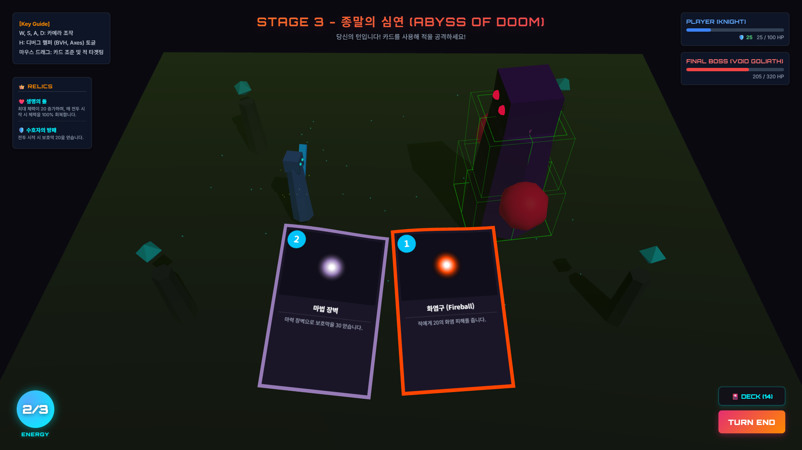

---

## 4. 실시간 전투 피격 및 방어 연출 메커니즘 (인게임 비주얼 극대화)

### 1) 플레이어 공격 시 타격감 연출 (Camera Shake, Zoom, Screen Flash, Particles)

* **그래픽스 연출**:
  * 카드를 적에게 조준해 사용하는 순간, 스펠 효과음 성향에 맞추어 다양한 가상 효과들이 프레임 루프에서 실시간으로 융합 구동됩니다.
  * **카메라 임팩트(Camera Shake & Zoom)**: 타격 순간 카메라 뷰 행렬(View Matrix)에 무작위 진동 변이를 더하고 Z축 거리를 당기는 줌인(Zoom-in)을 처리한 뒤, 프레임 경과에 따라 서서히 원래 화각으로 복구시킵니다.
  * **화면 번쩍임(Screen Flash)**: `#flash-overlay` 엘리먼트의 투명도를 순간적으로 0.28까지 끌어올린 뒤 복구하여 시각적 충격을 유도합니다.
  * **3D 파티클 방출(Particle Burst)**: 피격 원점에서 중력 가속도($g = -9.8 \text{ m/s}^2$)와 속력 마찰 계수가 연동된 3D 구체(`SphereGeometry`) 파티클 20개를 카드의 고유 색상(`colorHex`)을 상속하여 분사합니다.
* **구현 코드**:
  * [scene.js:L100-L151](file:///Volumes/Seagate/.Spotlight-V100/kwclass/4-1/컴퓨터그래픽스/final_assignment/src/js/scene.js#L100-L151) 및 [main.js:L67-L82](file:///Volumes/Seagate/.Spotlight-V100/kwclass/4-1/컴퓨터그래픽스/final_assignment/src/js/main.js#L67-L82)
  * **설명**: 피격 위치에서 파티클들의 3D 위치를 매 프레임 업데이트하며, Y축 가상의 중력 가속도를 적용해 포물선 궤적을 갖게 하고, `life` 감쇄율을 연계해 서서히 희미하게 작아지며 소멸되도록 구현했습니다.
* **📸 리포트용 캡쳐 가이드**:
  > 카드를 타겟 몬스터에게 릴리즈하여 공격이 관통하는 프레임의 **화면 플래시(백색 반사광)가 번쩍이며 카메라가 흔들리고 줌인된 순간**을 캡쳐하십시오. 또한 피격 지점에서 **카드의 속성색(예: 오렌지색, 냉기색)을 상속받은 구형 3D 파티클 무리가 사방으로 중력 낙하 궤적을 그리며 튕겨나가는 폭발 프레임**을 캡쳐하십시오.
  >

  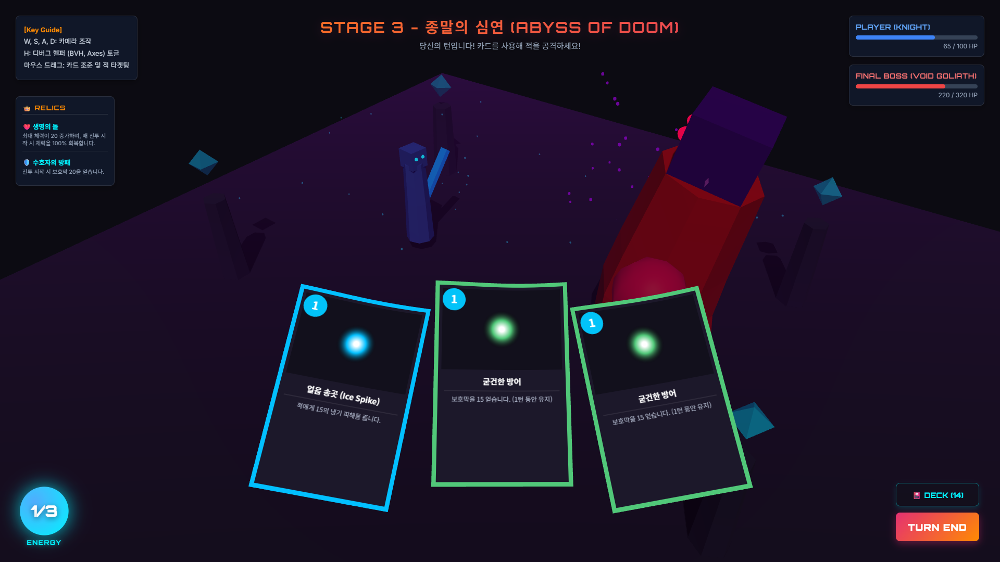

### 2) 조건부 피격 및 방어막 차단 이펙트 (Dynamic Shield Hologram)

* **조건 분기형 비주얼 반응**:
  * 보스가 공격을 가해올 때 플레이어의 현재 방어막(Shield) 잔여량과 보스의 공격 피해량을 연산하여 연출 상태를 이중 분기합니다.
  * **경우 A (완전 방어 - HP 손실 0)**:
    * 실드가 공격력을 완전히 흡수한 경우, 플레이어 캐릭터 기사 앞에 **3D 쉴드 홀로그램 메쉬(`RingGeometry`)**를 동적으로 소환하여 팽창 소멸시킵니다.
    * 이 경우 캐릭터의 자세가 일그러지지 않고 충격을 흡수했으므로 **기사 스켈레탈 뼈대의 피격 흔들림 모션(`triggerDamaged`)을 완전히 스킵**하고 미세한 카메라 진동만 인가하여 완전 방어의 묵직한 피드백을 전달합니다.
  * **경우 B (관통 피격 - HP 손실 > 0)**:
    * 실드가 뚫리거나 없는 경우 기사 몸체가 격렬하게 흔들리는 `triggerDamaged` 피격 모션을 발동하고, 피격점 주변에 붉은색 피격 파티클(`0xff1111`) 폭발 및 격렬한 화면 흔들림과 적색 광역 플래시 연출을 결합합니다.
* **📸 리포트용 캡쳐 가이드**:
  > 1. **완전 방어 상황**: 방어를 잔뜩 올린 상태에서 보스의 공격을 받았을 때 플레이어 캐릭터(Knight) 앞에 **동심원의 반투명 수호 초록색 방패 홀로그램 고리(RingGeometry)**가 동적으로 팽창 소환되고 기사는 흔들림 모션을 보이지 않고 의연히 서 있는 차단 스냅샷을 캡쳐하십시오.
  > 2. **관통 피격 상황**: 실드가 다 닳은 상태에서 타격당해 기사의 몸체가 붉게 빛나며 뒤로 흔들리고 주변에 붉은 피격 파티클이 뿜어지는 타격 프레임을 비교용으로 캡쳐해 조건부 피격 분기를 서술하십시오.
  >

  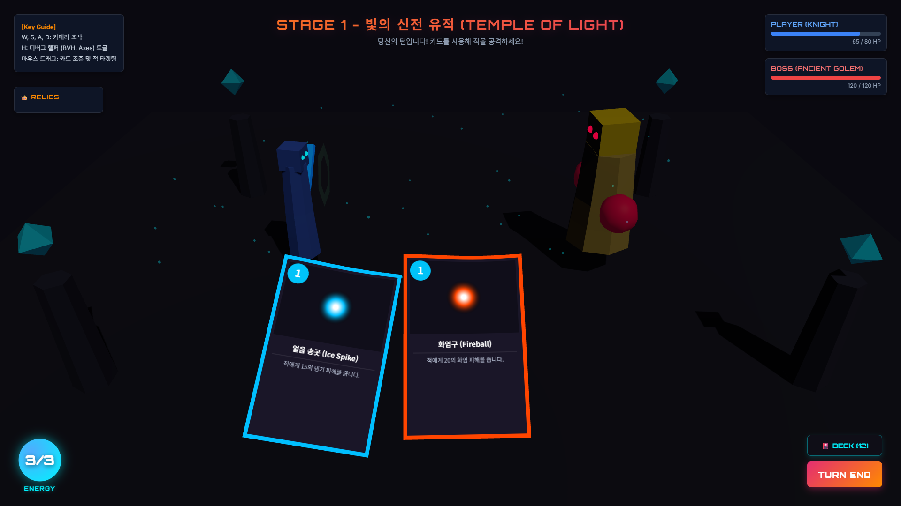

### 3) 방어 카드 전용 이펙트 (Defense VFX)

* **그래픽스 연출**:
  * 방어 카드를 시전할 때 플레이어 주변 바닥에서 하늘 방향으로 솟구치는 상자 모양의 파티클(`BoxGeometry`) 15개를 생성하여 차오르는 수호 장벽 효과를 은유적으로 연출합니다.
* **📸 리포트용 캡쳐 가이드**:
  > '굳건한 방어' 카드를 시전할 때 플레이어 기사 메쉬 발밑 주변에서 **초록색 수호 빛깔을 지닌 다수의 3D 정육면체(BoxGeometry) 파티클들이 분수처럼 수직 위 방향으로 솟구치며 에너지를 흡수하는 연출 장면**을 캡쳐하십시오.
  >

  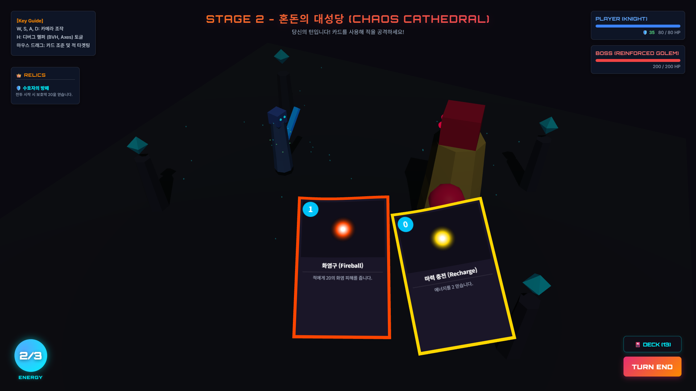

---

## 5. UI 동적 바인딩 및 편의성 개선 메커니즘

* **유물 획득에 따른 실시간 텍스처 리드로우 (Canvas Texture Refresh)**:
  * 플레이어가 보스를 클리어하여 모든 공격 카드의 피해량을 +5 시켜주는 `🔥 불꽃의 심장(fire_heart)` 유물을 선택 획득하면, 인게임 댐감 연산 처리와 더불어 손패에 이미 쥐고 있는 카드의 Canvas 텍스처 데이터까지 실시간으로 업데이트하는 `refreshHandCardTextures()` 함수를 개발하여 WebGL의 텍스처를 갱신 및 재바인딩해 텍스트 정보의 일치성을 유지했습니다.
* **물음표 마우스 호버 및 클릭 알림**:
  * 획득한 유물 패널에 `cursor: help`를 선언하여 직관적으로 도움말 상태로 상호작용할 수 있음을 표기하고, 마우스 호버 시 `title` 툴팁 및 클릭 시 팝업을 통해 상세 유물 효과를 즉각 읽어올 수 있도록 하여 게임 중 인출 능력을 향상시켰습니다.
* **카드 시전 편의성 제스처 (Gesture & Action Shortcut)**:
  * 모바일 친화적이거나 마우스 조작을 극대화하기 위해, 카드를 보스 캐릭터에 정확히 가져다 드롭하지 않아도 화면의 중간 수평선 위(`mouse.y > 0`)로 던지듯이 드래그 릴리즈하면 즉시 시전이 되도록 연산(상향 릴리즈 시전)을 적용하였습니다.
  * 또한, 카드를 더블 클릭할 경우 덱에서 교사(Raycast)되는 해당 카드가 즉각 몬스터에게 발사되거나 방어막이 발동하는 **더블 클릭 즉시 시전** 단축 핸들러를 바인딩하여 쾌적한 템포의 전투 인터랙션을 제공합니다.
* **전략적 손패 드로우 및 덱 관리 규칙 (Deck & Hand Balancing Algorithm)**:
  * 턴 시작 시 패에 카드가 부족할 경우 강제로 최소 3장을 드로우하여 복구해 주고, 이미 3장 이상의 카드를 가지고 있다면 1장만 추가 드로우하도록 설계하여 플레이어의 핸드 균형과 전략적 카드 관리를 도모하였습니다.
* **📸 리포트용 캡쳐 가이드**:
  > 1. **실시간 데미지 변동**: `🔥 불꽃의 심장` 유물을 먹기 전 공격 카드의 설명(예: '20의 화염 피해')과 유물 획득 후 실시간으로 카드 표면 및 덱 보기 모달 내의 텍스트가 **'+5' 증가하여 즉각적으로 재인쇄된 모습(예: '25의 화염 피해')**의 비포/애프터 비교 컷을 구성하십시오.
  > 2. **유물 확인성 개선**: 인게임 좌측 상단 `relics-list` 패널의 유물 아이템 위에 마우스를 얹었을 때 **물음표(?) 커서와 설명 툴팁이 뜬 상태, 혹은 클릭하여 상세 효과 알림창(`alert`)이 발생한 인게임 플레이 화면**을 캡쳐해 사용자 편의성 극대화 부분을 작성하십시오.
  >

  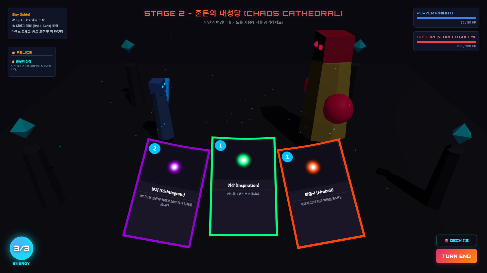

---

## 6. 추가 고급 비주얼 및 이펙트 최적화 기법 (A+ 가산점 요소)

본 프로젝트는 완성도를 극대화하고 씬 전체의 마법적 분위기를 환기하기 위해 4가지 고급 그래픽스 연출 기법을 유기적으로 연동하여 구현하였습니다.

### 1) 투사체 비행 시 잔상 이펙트 (Particle Trail)

* **그래픽스 이론**:
  * 비행하는 물체의 속도감을 시각적으로 극대화하기 위해 잔상(Trail) 효과를 연출합니다.
  * 매 프레임 투사체(`Projectile`)의 실시간 3D 좌표에 크기가 점진적으로 작아지고 투명도(Alpha)가 0으로 수렴하는 미세 구체 잔상 메쉬를 동적 스폰합니다.
  * 또한 잔상이 빛나보이도록 가산 혼합(`THREE.AdditiveBlending`) 및 투명도 렌더링을 적용합니다.
* **구현 코드**:
  * **소스 코드 위치**: [scene.js:L430-L457](file:///Volumes/Seagate/.Spotlight-V100/kwclass/4-1/컴퓨터그래픽스/final_assignment/src/js/scene.js#L430-L457) (`updateProjectiles` 내)
  * **코드 스니펫**:
    ```javascript
    // 투사체 비행 시 잔상 이펙트 (Particle Trail) 추가
    if (proj.mesh && Math.random() < 0.85) {
        const trailGeo = new THREE.SphereGeometry(proj.radius * 0.5, 4, 4);
        const trailMat = new THREE.MeshBasicMaterial({
            color: proj.colorHex,
            transparent: true,
            opacity: 0.55,
            blending: THREE.AdditiveBlending
        });
        const trailMesh = new THREE.Mesh(trailGeo, trailMat);
        trailMesh.position.copy(proj.mesh.position);
        scene.add(trailMesh);
        
        activeParticles.push({
            mesh: trailMesh,
            vel: new THREE.Vector3(0, 0, 0),
            life: 0.6,
            decay: 0.05
        });
    }
    ```
* **📸 리포트용 캡쳐 가이드**:
  > 카드가 시전되어 투사체가 날아갈 때, **투사체 구체 뒤쪽으로 카드의 고유 속성 색을 지닌 아름다운 입자 꼬리 잔상들이 비행 궤적을 그리며 맺혀 있는 순간**을 캡쳐하십시오.
  >
  
  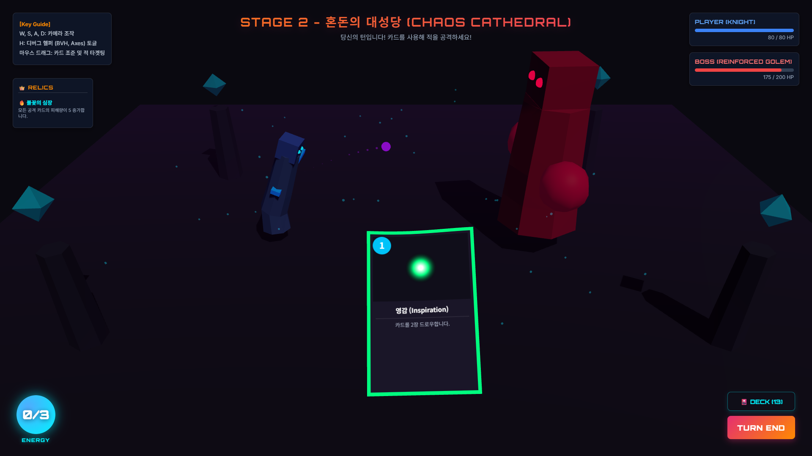

### 2) 대기 중 부유하는 발광 에테르 먼지 (Floating Dust Particles)

* **그래픽스 이론**:
  * 3D 안개(`THREE.FogExp2`) 대기 상태에 풍부한 볼륨감을 주기 위해, 개별 먼지 입자 정점들에 시간 흐름에 비례한 **절차적 삼각함수 파동(Sine Wave Perturbation)**을 주어 공중에 둥둥 부유하는 연출을 적용합니다.
  * 특정 고도 Y 이상으로 상승하면 다시 바닥 영역으로 위치를 리셋(Wrap-around)시킴으로써 최소한의 객체 수로 무한 루프 시뮬레이션을 구현합니다.
* **구현 코드**:
  * **소스 코드 위치**: [scene.js:L44-L96](file:///Volumes/Seagate/.Spotlight-V100/kwclass/4-1/컴퓨터그래픽스/final_assignment/src/js/scene.js#L44-L96) 및 [main.js:L165](file:///Volumes/Seagate/.Spotlight-V100/kwclass/4-1/컴퓨터그래픽스/final_assignment/src/js/main.js#L165)
  * **코드 스니펫**:
    ```javascript
    export function updateFloatingDust() {
        const time = performance.now() * 0.0015;
        floatingDust.forEach(d => {
            d.mesh.position.y += d.speedY; // 수직 상승 운동
            d.mesh.position.x += Math.sin(time + d.phase) * d.rangeX; // X축 미세 흔들림
            if (d.mesh.position.y > 130) {
                d.mesh.position.y = -20; // 재생성 루프
            }
        });
    }
    ```
* **📸 리포트용 캡쳐 가이드**:
  > 전장 전체 뷰를 캡쳐하여 **공중에 미세하게 빛나는 민트빛/푸른빛 에테르 파티클들이 상하좌우로 둥실둥실 떠다니며 신비로운 배경 공간감을 형성하고 있는 상태**를 서술하십시오.
  >
  
  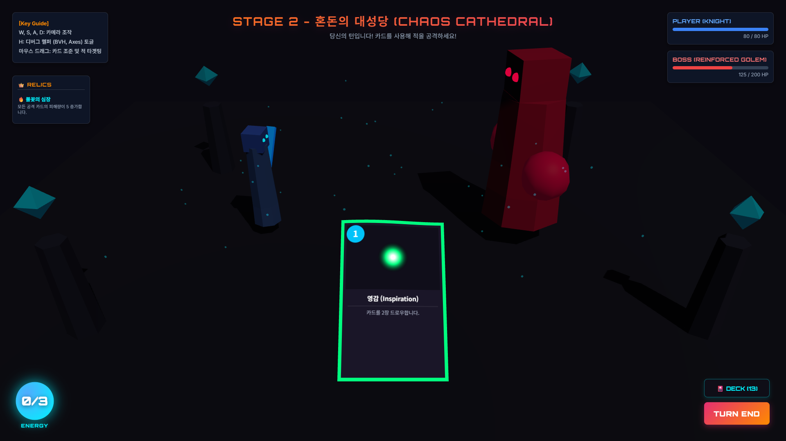

### 3) 캐릭터 안광 부착 (Emissive Glow Eyes)

* **그래픽스 이론**:
  * 캐릭터의 디자인 완성도를 향상하기 위해, 관절 구조인 **뼈대 계층 구조(Joint/Bone Hierarchy)**의 최상단 헤드 본(`bones[last]`)에 로컬 오프셋을 조정한 발광 메쉬(`MeshBasicMaterial`) 두 개를 자식 노드로 결합합니다.
  * 머리 뼈가 애니메이션(대기 숨쉬기, 공격 흔들림, 피격 밀림)에 의해 기하 변환 행렬 연산을 겪을 때, 자식 노드인 안광 메쉬 역시 **행렬 계층 상속(Hierarchical Matrix Transform)**에 의해 일체형으로 완벽하게 추종하여 움직입니다.
* **구현 코드**:
  * **소스 코드 위치**: [character.js:L75-L89](file:///Volumes/Seagate/.Spotlight-V100/kwclass/4-1/컴퓨터그래픽스/final_assignment/src/js/character.js#L75-L89)
  * **코드 스니펫**:
    ```javascript
    // 안광 (Emissive Glow Eyes) 추가
    const eyeGeo = new THREE.SphereGeometry(this.isEnemy ? 4 : 2.5, 8, 8);
    const eyeMat = new THREE.MeshBasicMaterial({ color: this.isEnemy ? 0xff0044 : 0x00f2fe });
    
    // 왼쪽 안광 메쉬 부착
    const eyeL = new THREE.Mesh(eyeGeo, eyeMat);
    eyeL.position.set(-sz * 0.22, sz * 0.1, sz * 0.51);
    head.add(eyeL);
    
    // 오른쪽 안광 메쉬 부착
    const eyeR = new THREE.Mesh(eyeGeo, eyeMat);
    eyeR.position.set(sz * 0.22, sz * 0.1, sz * 0.51);
    head.add(eyeR);
    ```
* **📸 리포트용 캡쳐 가이드**:
  > 플레이어 기사의 투구 정면에서 **눈 부위가 푸른빛으로 영롱하게 빛나는 안광** 및 보스 캐릭터가 **붉은 빛/자주 빛으로 강렬하게 안광을 뿜으며 서 있는 정면 얼굴 뷰**를 크로즈업하여 캡쳐하십시오.
  >
  
  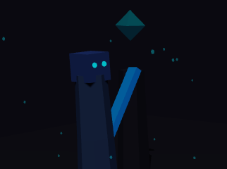

### 4) 전장 디오라마 국경선 장식 (Arena Boundary Decors)

* **그래픽스 이론**:
  * 씬의 완성도와 깊이감을 극대화하기 위해 전장 바닥 타일 경계면에 고대 유적 기둥(`CylinderGeometry`)과 실시간으로 회전/부유하는 고대 크리스탈(`OctahedronGeometry`) 메쉬들을 입체 배치합니다.
  * 회전 행렬 $R_y$, $R_x$와 수직 이동 행렬 $T_y$를 수동 보간 연산하여 씬에 역동감을 부여합니다.
* **구현 코드**:
  * **소스 코드 위치**: [scene.js:L142-L177](file:///Volumes/Seagate/.Spotlight-V100/kwclass/4-1/컴퓨터그래픽스/final_assignment/src/js/scene.js#L142-L177) 및 [scene.js:L98-L105](file:///Volumes/Seagate/.Spotlight-V100/kwclass/4-1/컴퓨터그래픽스/final_assignment/src/js/scene.js#L98-L105)
  * **코드 스니펫**:
    ```javascript
    export function updateDecors() {
        const time = performance.now() * 0.001;
        boundaryDecors.forEach((cry, idx) => {
            cry.rotation.y = time * 0.5 + idx; // 자전 운동
            cry.rotation.x = Math.sin(time * 0.8 + idx) * 0.2;
            cry.position.y = 80 + Math.sin(time * 1.5 + idx) * 12; // 수직 부유 운동
        });
    }
    ```
* **📸 리포트용 캡쳐 가이드**:
  > 전장 네 모서리에 조각되어 솟아 있는 **고대 유적 기둥들의 실시간 그림자 명암**과, 그 위에 공중부유하여 **스스로 옥빛으로 회전하며 위아래로 둥실거리는 마법 크리스탈의 모습**을 지시선과 함께 캡쳐해 첨부하십시오.
  >
  
  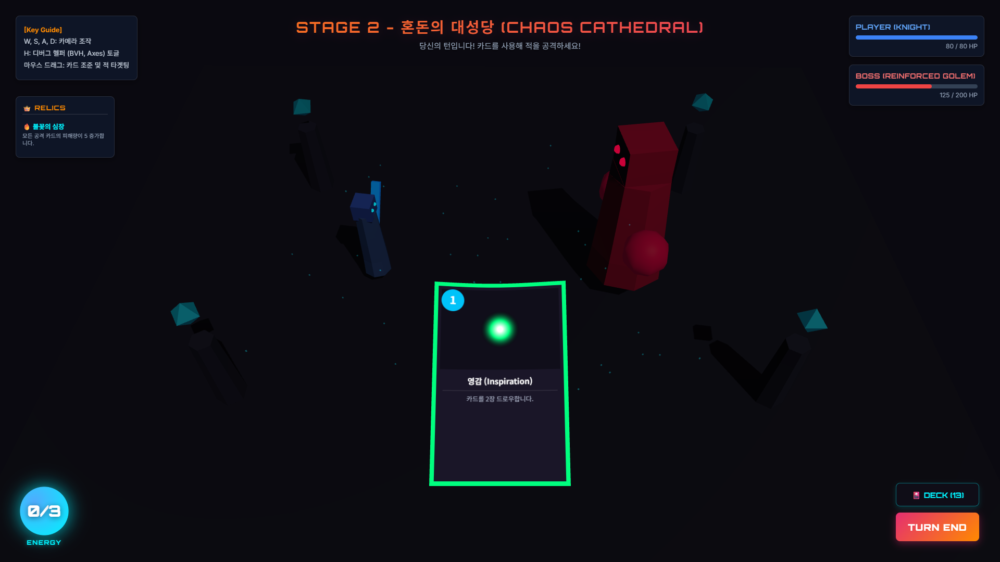

